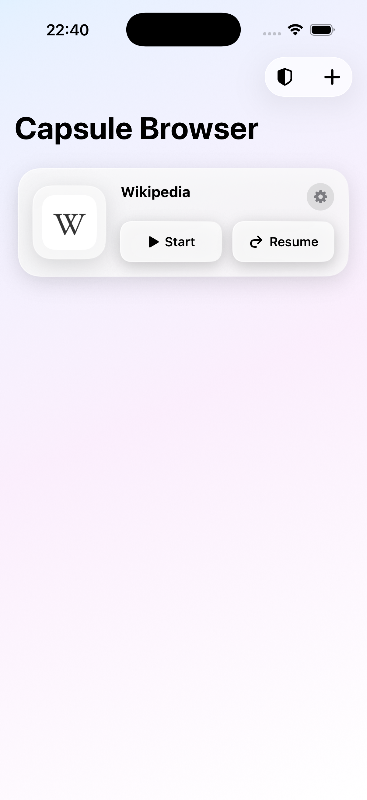

# Capsule Browser

**Capsule Browser** is a privacy-first web application container for macOS and iOS that transforms websites into independent, isolated web apps.

---

### 🛡️ Built for Total Privacy & Multi-Account Isolation

Traditional web browsers share cookie jars, local storage, and caches across tabs, enabling third-party tracking networks and data brokers to profile your browsing habits across different websites. **Capsule Browser completely eliminates cross-site tracking through strict container isolation:**

* **🚫 Zero Cross-Site Tracking:** Each web app runs in its own sandboxed WebKit container with an isolated, non-persistent data store (`WKWebsiteDataStore.nonPersistent()`). Trackers, cookies, local storage, and fingerprints are strictly partitioned and cannot leak across your web apps.
* **👥 Multi-Account Support on the Same Website:** Create multiple distinct capsules for the same service (e.g., *Personal GitHub* vs. *Work GitHub*, multiple Google/Gmail accounts, or separate social media identities). Each capsule maintains its own independent login session without interfering with the others.
* **🛡️ Integrated uBlock Origin Lite:** Advanced built-in ad and tracker blocking, cosmetic element hiding, and scriptlet defusers powered by uBlock rulesets compiled natively to WebKit content rules.
* **☁️ Private CloudKit Sync:** Your web apps, preferences, and serialized sessions sync securely between your Apple devices via your private iCloud database with zero third-party telemetry or analytics.



---

[](https://github.com/Eddy-Barraud/Capsule-browser/actions/workflows/release.yml)

## Features

- **Isolated Web Containers:** Independent cookies, cache, and local website storage for each web app.
- **Multi-Identity & Multi-Session:** Run multiple concurrent accounts for any website with complete separation.
- **Anti-Tracking & Ad-Blocking:** Built-in uBlock Origin Lite rulesets with configurable filter lists and cosmetic element hiding.
- **Cross-Device Sync:** CloudKit synchronization of web apps, settings, display order, and isolated sessions across iOS and macOS.
- **Safari Reader Mode Integration:** Option to open external links in Safari reader mode (`SFSafariViewController` on iOS / Safari on macOS).
- **Home Screen & Custom App Tiles:** Fast, customizable home screen grid with automatic favicon fetching and drag-and-drop reordering.
- **Smart AI Web Page Summaries:** On-device Apple Foundation Models web page summarization.
- **Platform-Native UI:** Solid native toolbar on macOS and floating Liquid Glass controls on iOS with swipe-to-home gesture navigation.
- **Clean Lifecycle Teardown:** Complete teardown of WebViews on exit to halt background activity and battery drain.

## Build and Run

1. Clone with the uBlock Origin Lite submodule:

   ```sh
   git clone --recurse-submodules https://github.com/Eddy-Barraud/Capsule-browser.git
   ```

2. Open `isowebapps.xcodeproj` in Xcode.
3. Select the `Capsule-Browser` scheme and a macOS or iOS destination.
4. Build and run.

Command-line builds can use the generic destinations:

```sh
xcodebuild -project isowebapps.xcodeproj \
  -scheme Capsule-Browser \
  -destination 'generic/platform=macOS' \
  -derivedDataPath ./build build

xcodebuild -project isowebapps.xcodeproj \
  -scheme Capsule-Browser \
  -destination 'generic/platform=iOS' \
  -derivedDataPath ./build build
```

The project expects the ruleset resource link at `isowebapps/rulesets`, pointing to `../shared/uBOL-home/chromium/rulesets`. Keep the submodule checked out when building or testing filtering.

## Source Files

- `isowebappsApp.swift`: application entry point and SwiftData model container.
- `ContentView.swift`: saved-app home screen, add/settings sheets, deletion, and data clearing.
- `WebAppItem.swift`: persisted web app model and Codable cookie representation.
- `Item.swift`: unused Xcode template model retained for reference; it is not part of the app schema.
- `AddWebAppSheet.swift`: validates new URLs, fetches favicons, and creates `WebAppItem` records.
- `WebAppContainerView.swift`: active web app layout, URL bar, navigation controls, sharing, and dismissal.
- `IsolatedWebView.swift`: `WKWebView` wrapper, delegates, navigation KVO, cookie observation, configuration, and teardown.
- `CookieManager.swift`: restores, serializes, saves, and clears per-app cookies.
- `FaviconFetcher.swift`: downloads and decodes website icon data.
- `PlatformAdapters.swift`: shared image and activity-sharing abstractions for UIKit and AppKit.
- `LiquidGlassStyles.swift`: reusable Liquid Glass card and button styling.
- `AISummarizer.swift`: provides on-device Apple Foundation Models web page summarization from rendered first-page PDF text.
- `UBlockRuleCompiler.swift`: converts uBlock declarative network request rules into WebKit content blocker rules.
- `UBlockOriginExtensionManager.swift`: locates filter lists, compiles independent `WKContentRuleList` instances, and injects cosmetic scripts.
- `UBlockSettingsView.swift`: filter and scriptlet preferences plus active rule/list diagnostics.

## Architecture and Data Flow

`isowebappsApp` creates the SwiftData container and presents `ContentView`. The home screen queries `WebAppItem` records. Selecting one presents `WebAppContainerView`, which creates an `IsolatedWebViewRepresentable` for that record and binds toolbar state through `WebViewNavigationState`.

`IsolatedWebView` creates a new non-persistent WebKit data store for the selected app. `CookieManager` restores that app's serialized cookies before loading its URL and observes cookie changes for persistence. Navigation delegates and Key-Value Observing (KVO) update the URL bar, loading state, and back/forward state. Dismissing the container stops loading and tears down the web view.

At startup, `ContentView` asks `UBlockOriginExtensionManager` to prepare. The manager reads enabled JSON rulesets from the linked uBOL resources, asks `UBlockRuleCompiler` to translate them, compiles each ruleset independently, and applies the resulting WebKit rule lists and user scripts to new web view configurations.

## Limitations and Notes

- uBlock filters use WebKit's content blocker format, so unsupported or malformed source rules are dropped during validation. The manager retains valid rules and reports rejected rules in debug output.
- The ruleset symlink and initialized submodule are required for bundled filtering resources.
- CloudKit synchronization requires the correct Apple Developer entitlements, iCloud container configuration, signing team, and runtime device testing. Generic builds only verify compilation.
- WebKit non-persistent data stores isolate site data at runtime; cookie persistence is explicitly copied into SwiftData and is not a complete substitute for every browser storage API.
- Website behavior, redirects, popups, media playback, and content blocker support vary between iOS and macOS. Test important sites on each target platform.
- The app has no authentication layer of its own. Website login state is controlled by the site's cookies and storage.
